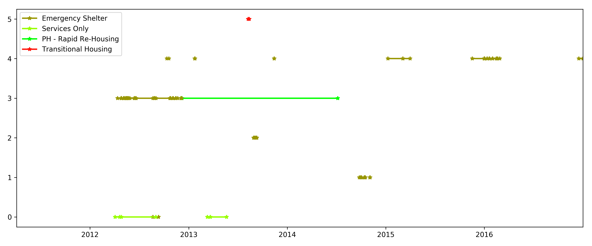
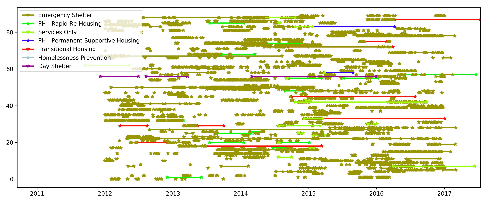
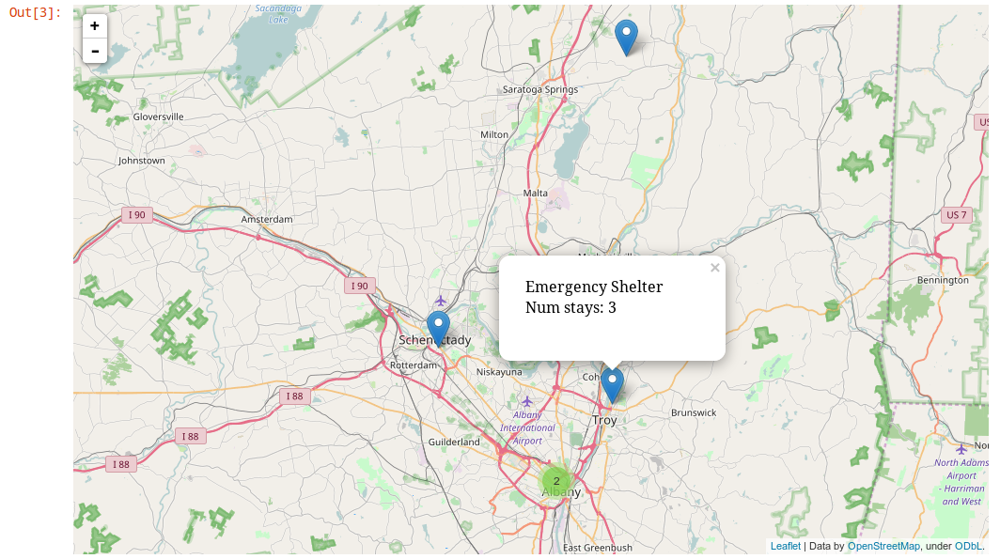

======
 Usage
======

Here we walk you through the steps to start analyzing hmis data in a
python/Jupyter environment. 

Note that in the ``scripts_and_examples`` subdirectory, there are some
Jupyter notebooks that walk you through some simple selection and visualization
examples. 

Create primary dictionary file
------------------------------

Put together a dictionary of all the individuals in the HMIS data dump and determine the connections and relationships between the different entries in the different files.

First create the .pkl file:

.. code-block:: bash

    $ python build_primary_dictionary_file.py <tag>
    
You will want to edit this file to point it to the directory where
the 11 .csv files from the HMIS database dump reside. 

This creates an output file 

.. code-block:: bash

    hmis_data<tag>,pkl

The script is set up by default to look in ``hmis/test_data`` for the .csv files.
This repository provides a very small sample of *fake* HMIS data for the 
unit tests. There is also a sample pickle file includes (in case you don't want to 
build your own for testing) called ``hmis_test_data.pkl``.
In both cases, the identifier for individuals ``Personal ID`` has been 
hashed and anonymized.

Examples below that display plots use a more complete data sample than the fake
data included with this repository.

**Warning!** If you are working with a particularly large HMIS data dump,
it can take up to an hour or more to build the pickle file. However, 
your later analysis will be quite fast. 

Now let's take a look at some of this data. The following commands are what you 
would type in Jupyter/IPython or in a python script. 

Import necessary packages
-------------------------

.. doctest::

    >>> import hmis
    >>> import plotly
    >>> import matplotlib.pylab as plt
    >>> import folium # For mapping
    
    
If you are using a Jupyter notebook make sure to include the following in order to 
display plots inline. 

.. doctest:: 

    >>> plotly.offline.init_notebook_mode()
    >>> %matplotlib notebook

Read the dictionary file
------------------------

Once you have made your pickle file of the data dump, you can read it.

In the following example, ``data`` is a list of dictionaries. 
Note that ``hmis_data.pkl`` is the file you created, but if you want, you 
can use the sample file included in this repo, ``hmis_test_data.pkl``.

.. doctest::

    >>> filename = 'hmis_data.pkl'
    >>> data = hmis.read_dictionary_file(filename)

Pretty print a subset of individuals
------------------------------------

.. doctest::

    >>> hmis.pretty_print(data[0:10])

    ================================
    91585d365
    01/15/1972
    Emergency Shelter                   In/Out: 08/21/2012 - 09/11/2012 (21 days)    Zip code: 12901
    Services Only                       In/Out: 04/03/2012 - 04/26/2012 (23 days)    Zip code: 12901
    Services Only                       In/Out: 03/11/2013 - 03/22/2013 (11 days)    Zip code: 12901
    Services Only                       In/Out: 04/20/2012 - 09/01/2012 (134 days)   Zip code: 12901
    Services Only                       In/Out: 03/22/2013 - 05/21/2013 (60 days)    Zip code: 12901
    ================================
    935135846
    03/09/1993
    Emergency Shelter                   In/Out: 09/25/2014 - 09/29/2014 (4 days)     Zip code: 12250
    Emergency Shelter                   In/Out: 09/30/2014 - 10/03/2014 (3 days)     Zip code: 12250
    Emergency Shelter                   In/Out: 10/13/2014 - 10/14/2014 (1 days)     Zip code: 12250
    Emergency Shelter                   In/Out: 10/15/2014 - 10/17/2014 (2 days)     Zip code: 12250
    Emergency Shelter                   In/Out: 11/03/2014 - 11/04/2014 (1 days)     Zip code: 12250
    ================================
    1cb8da6b1
    11/17/1978
    Emergency Shelter                   In/Out: 08/29/2013 - 08/30/2013 (1 days)     Zip code: 12180
    Emergency Shelter                   In/Out: 09/02/2013 - 09/06/2013 (4 days)     Zip code: 12180
    Emergency Shelter                   In/Out: 09/08/2013 - 09/10/2013 (2 days)     Zip code: 12180
    ================================
    92e935388
    09/20/1952
    PH - Rapid Re-Housing               In/Out: 12/07/2012 - 07/07/2014 (577 days)   Zip code: 12601
    Emergency Shelter                   In/Out: 04/12/2012 - 04/25/2012 (13 days)    Zip code: 12601
    Emergency Shelter                   In/Out: 04/26/2012 - 04/27/2012 (1 days)     Zip code: 12601
    Emergency Shelter                   In/Out: 05/04/2012 - 05/06/2012 (2 days)     Zip code: 12601
    Emergency Shelter                   In/Out: 05/07/2012 - 05/12/2012 (5 days)     Zip code: 12601
    Emergency Shelter                   In/Out: 05/15/2012 - 05/16/2012 (1 days)     Zip code: 12601
    ...

In the above case, the first 10 entries in the file (fewer are displayed for readability) are printed
out. However, you could select a subset of individuals, based on their ``Personal ID``. The following example
returns a subset of the data selected this way as a list. 

.. doctest::

    >>> names = ['91585d365', '935135846', '1cb8da6b1','92e935388', '9293c9520', '1cb9a120b']
    >>> subset = hmis.subset_from_dictionary(names,data)

Select individuals of interest to visualize
-------------------------------------------

From this list of dictionaries ``data``, you can select individuals that are within a certain  age range:

.. doctest:: 

    >>> lo = 31
    >>> hi = 33
    >>> selected_people = hmis.select_by_age(data,lo=lo,hi=hi)
    
    
Additionally, you can select individuals from ``data`` that have been to at least a certain number of progams:

.. doctest::
    
    >>> num_of_programs = 27
    >>> selected_people = hmis.select_by_number_of_programs(data,num_of_programs)

Visualize time-series plots
---------------------------

From the ``selected_people``, you can plot their time-series plots:

.. doctest:: 

    >>> image_name = 'plotting_example.png'
    >>> fig = plt.figure(figsize=(12,5)
    >>> hmis.plot_time_series(selected_people, image_name)

    Sample time series for a subset of individuals from the dataset. 
    Each row represents an individual and when they entered or exited
    various support systems.

    Sample time series for a subset for a larger number of individuals.

You can also add an additional argument and value ``plotly=True`` to use the plotly plotting module. 

    
    
    
Visualize program locations
----------------------------

From the ``selected_people``, you can plot the location of their programs.
(this only works in the Jupyter environment)

.. doctest:: 

    >>> mymap = hmis.plot_program_locations(data[0:2])
    >>> mymap

    Map of locations of support mechanisms used by the two individuals passed in. 
    Hovertext of the markers reveals the zipcode and the total number of times
    all individuals have stayed there. 

Write your own visualizations
-----------------------------

Because the basic data is imported into an environment, users have access to the 
full python ecosystem and are encouraged to expand upon these visualizations
and analysis functions. 

